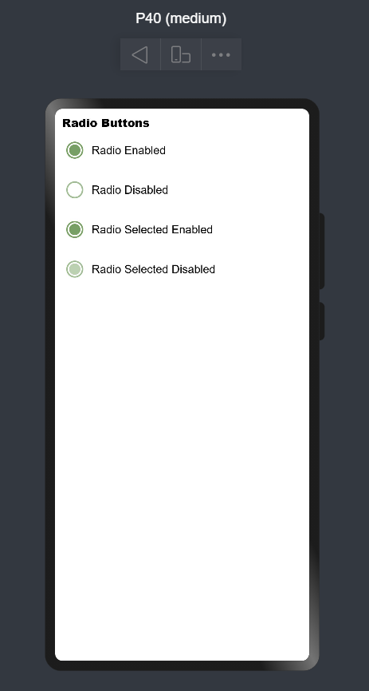
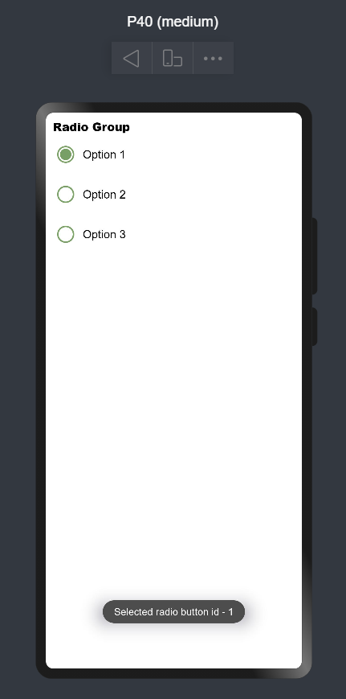
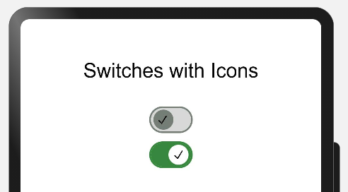
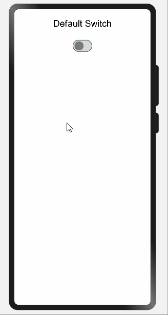
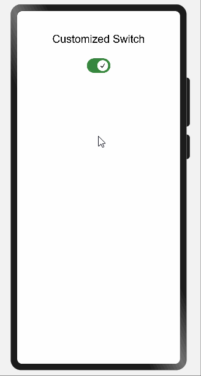

# MaterialUI_libraries

# Overview
Material Design is a design standard for creating and designing websites and apps. Material design was introduced to bring order and unity to web design.

Material design concept was inspired by paper and ink in the physical world. As paper exists in three dimensions having shadows and can be structured in different ways same way material design works. It removed the flat UI's with three dimensional designs.


# What is MaterialUI?
# Benefits

* Offers an element of flexibility.
* Material Design provides a clean and intuitive interface.
* Can be applied to complex and rare use cases.
* Having a vast set of guidelines and documentation.

# Typical Use Cases
# Usage Instructions
# List of Libraries

# 1. Buttons
# 2. Radio Buttons

A **radio button** is a component used to select only one option from a predefined set of options, therefore it is also called as ***option button***.

Radio buttons are used where users need to select only one option out of 2 or more options. These options contain circular white space. If any option is selected then circular white space is getting filled with a dot.
If any option is already selected and you will click on any other option then the first option will be deselected.

In the image below **One** is *selected*, **Two** & **Three** are *deselected*.


## 2. Benefits

* User can see all options at once.
* Quicker and Easier to use.

## 3. Typical UseCases:

MaterialRadio library can be implemented in most of the commonly used applications where users have to select only one option out of many. Below are some of the examples:


## 4. List of Features:

There are few features of Radio buttons listed below:

***1. Enabled:*** Radio button can be selected. (Vastly used in application)
```
RadioButton({
    model: this.radioModel1,
    onCheckChange: this.onRadioCheck
})
```

***2. Disabled:*** Radio button can't be selected.
```
aboutToAppear() {
    this.radioModel2.setDisabled(true);
}
RadioButton({
    model: this.radioModel2,
    onCheckChange: this.onRadioCheck
})
```

***3. Checked and Enabled:*** Radio button will be selected by default. While clicking the dot will show some ripple effect.
```
RadioButton({
    model: this.radioModel3,
    checked: true,
    onCheckChange: this.onRadioCheck
})
```

***4. Checked and Disabled:*** Radio button will be selected and can't be deselected. This button appears a little bit off color.
```
aboutToAppear() {
    this.radioModel4.setDisabled(true);
}
RadioButton({
    model: this.radioModel4,
    checked: true,
    onCheckChange: this.onRadioCheck
})
```

Please refer below Image: 


## 5. Download & Install:

Install using npm: 
```
npm i ohos-material-radio
```

Details about OpenHarmony NPM environment configuration, click [here](https://gitee.com/openharmony-tpc/docs/blob/master/OpenHarmony_npm_usage.md). 

<hr/>

## 6. Usage Instructions:

1. Import files and code dependencies

```ets
import { RadioButton, RadioGroup, RadioOption, RadioModel }  from '@ohos/material-radio'
```

2. Initialize model data

```
private radioModel: RadioModel = new RadioModel(1, "Radio Label")
```

3. Code for creating radio button

```
RadioButton({
    checked: true,
    model: this.radioModel,
    onCheckChange: (selectedRadioId) => {
        console.log("Selected Radio Button Id:: " + selectedRadioId);
    }
})
```



4. Code for creating radio group

```
RadioGroup(
    {
        selectedRadioId: 1,
        options: [new RadioOption(1, "Option 1"), new RadioOption(2, "Option 2")],
        onCheckChange: (selectedRadioId) => {
            console.log("Selected Radio Button Id:: " + selectedRadioId);
        }
    }
)
```



## 7. Library Features:

### Feature-1: 

***Description:*** User needs to provide radioId, radiolabel, selectedRadioId to create material radio button. Apart from those, users can also send checked and disabled properties also.

***Code Snippet:***

```
private radioModel: RadioModel = new RadioModel(1, “Radio Button”)
radioModel.setRingColor(Color.Blue);
radioModel.setDisabled(false);

RadioButton({
        model: this.radioModel,
        checked: false,
        onCheckChange: (id: number) => {
            console.log(“Radio button selected:: ” + id);
})
```
***Explanation:***

In above code one radio button was created, where button color was set to blue and was enabled for selection. By default it was deselected. While clicking button one toast will appear giving message "Radio button selected::*buttonid*"


Below are list of properties available:

|Properties|Description|
 |:-:|:-:|
 | `setRingColor`|Changing color of radio button circle|
 | `setDisabled` |making radio button enabled or disabled|
 | `checked`|showing radio button is selected or deselected by default|
 |||

***Screenshot:***


<br>

### Feature-2: 

***Description:*** User needs to provide a radio options list to create a material radio group.

***Code Snippet:***

```
private radioOptions: RadioOption [] = [
    new RadioOption(1, “Option 1”),
    new RadioOption(2, “Option 2”),
    new RadioOption(3, “Option 3”)
]

RadioGroup({
        options: this.radioOptions,
        onCheckChange: (id: number) => {
            console.log(“Selected radio button id:: ” + id);
      })
```

***Explanation:***

In the above code one Radio Group was created with 3 sets of options. By default all buttons will be deselected. If you click any option one toast will appear giving the message "Radio button selected::*buttonid*". Again if you click any other option then previous selected option will be deselected and one toast will appear "Radio button selected::*buttonid*"

***Screenshot:***


# 2. Sliders

Sliders allow users to make selections from a range of values. We can adjust volume, brightness or use it for selection in e-commerce application. Lets see how to create Slider.


#### Import
```js
import { MaterialSlider, SliderModel, SliderType } from '@ohos/materialslider'
```

#### Usage
Access slider attributes through a object of SliderModel and customize the slider(if needed) using setter functions and finally pass the object to MaterialSlider.

 Below are list of properties available.
 | Properties   | Description | Type |
 | -------------| ------------| -----|
 | SliderType     |   Defined the type of the Slider         | SliderType Enum (Continue, Discrete)  |
 | SliderStyle |    Defines the style of the Slider       | SliderStyle Enum (InSet, OutSet)  |
 | min, max|    Defines the minimum and maximun values of the Slider       |  number           |
 |  step         |   Step of the slider              |   number    |
 | showSteps  |  Whether to display the current step    |   boolean (Default: false)   |
 | showTips   |  Displays the bubble to indicate the percentage while sliding   | boolean (Default: false)  |
 | showMin, showMax | Displays the minimum and maximum values on the screen  | boolean   |
 |  showValue  | Displays the value of the Slider on the screen  |  boolean  |
 | trackThickness  |  Defines the thickness of the track  |  number   |
 |  reverse   | Whether to display the slider values in reverse  |  boolean (Default: false)  |
 |  direction  |  Defines the direction of the slider (Horizontally or Vertically)  | Axis Enum (Horizontal, Vertical)   |
 | currentValue  |  Current progress of the slider   |  number   |
 |  blockColor   |  Color of the Slider   |  ResourceColor  |
 |  trackColor   |  Background color of the Slider   |  ResourceColor  |
 |  selectedColor   |  Color of the Slider rail that has been slid |  ResourceColor  |
 |           |             |              |
 
 Below are the events that are supported by Slider
 | Properties   | Description |
 | -------------| ------------|
 | onSliderChange(callback: (value: number, mode: SliderChangeMode) => void)   |  Callback is invoked when the slider slides  <br /> **value** - Current Value of the Slider <br /> **mode** - Dragging state or Mode of the Slider (SliderChangeMode Enum - Begin, Moving, End)    |
 
#### Continuous Slider - Usage
Continuous sliders allow users to make selections that don’t require a specific value. These sliders are often used to adjust brightness or volume.

##### OutSet

```js
//Creating object of the SliderModel class with Slider type as Continue
private sliderModel: SliderModel = new SliderModel(SliderType.Continue)

//Customization of the SliderModel object and mentioning the SliderStyle as OutSet
aboutToAppear(){
    this.sliderModel.setSliderStyle(SliderStyle.OutSet)
    this.sliderModel.setMin(100)
    this.sliderModel.setMax(1000)
    this.sliderModel.setStep(1)
    this.sliderModel.setCurrentValue(500)
    this.sliderModel.setShowSteps(false)
    this.sliderModel.setShowTips(true)
    this.sliderModel.setTrackThickness(8)
    this.sliderModel.setReverse(false)
    this.sliderModel.setDirection(Axis.Horizontal)
    this.sliderModel.setShowValue(true)
    this.sliderModel.setShowMin(false)
    this.sliderModel.setShowMax(false)
    this.sliderModel.setBlockColor("#ff0477ff")
    this.sliderModel.setTrackColor("#D0D0D0")
    this.sliderModel.setSelectedColor("#ff0477ff")
}    

//Passing SliderModel object to MaterialSlider and defining the Event onSliderChange
MaterialSlider({
      obj: this.sliderModel1,
      onSliderChange:((value: number, mode: SliderChangeMode) => {
           console.log("Value: " + value + " Mode: " + mode);
      })
})
```


##### InSet

```js
//Creating object of the SliderModel class with Slider type as Continue 
private sliderModel: SliderModel = new SliderModel(SliderType.Continue)

//Customization of the SliderModel object and mentioning the SliderStyle as InSet
aboutToAppear(){
    this.sliderModel.setSliderSliderStyle(SliderStyle.InSet)
    this.sliderModel.setMin(0)
    this.sliderModel.setMax(100)
    this.sliderModel.setStep(1)
    this.sliderModel.setCurrentValue(40)
    this.sliderModel.setShowSteps(false)
    this.sliderModel.setShowTips(true)
    this.sliderModel.setTrackThickness(15)
    this.sliderModel.setReverse(false)
    this.sliderModel.setDirection(Axis.Horizontal)
    this.sliderModel.setShowValue(true)
    this.sliderModel.setShowMin(false)
    this.sliderModel.setShowMax(false)
    this.sliderModel.setBlockColor(Color.White)
    this.sliderModel.setTrackColor("#D0D0D0")
    this.sliderModel.setSelectedColor("#ff0477ff")
}    

//Passing SliderModel object to MaterialSlider and defining the Event onSliderChange
MaterialSlider({
      obj: this.sliderModel1,
      onSliderChange:((value: number, mode: SliderChangeMode) => {
           console.log("Value: " + value + " Mode: " + mode);
      })
})
```


#### Discrete Slider - Usage
Discrete sliders display a numeric value label upon pressing the thumb, allowing users to input an exact value. Discrete sliders only allow predefined sets of options or values to be selected. These sliders are often used in scenarios where there are pre-defined values are available like choosing shoe size or any clothing size, etc.

##### OutSet

```js
//Creating object of the SliderModel class with Slider type as Discrete 
private sliderModel: SliderModel = new SliderModel(SliderType.Discrete)

//Customization of the SliderModel object and mentioning the SliderStyle as OutSet
aboutToAppear(){
    this.sliderModel.setSliderStyle(SliderStyle.OutSet)
    this.sliderModel.setMin(1000)
    this.sliderModel.setMax(10000)
    this.sliderModel.setStep(1000)
    this.sliderModel.setCurrentValue(3000)
    this.sliderModel.setShowSteps(true)
    this.sliderModel.setShowTips(true)
    this.sliderModel.setTrackThickness(8)
    this.sliderModel.setReverse(false)
    this.sliderModel.setDirection(Axis.Horizontal)
    this.sliderModel.setShowValue(true)
    this.sliderModel.setShowMin(false)
    this.sliderModel.setShowMax(false)
    this.sliderModel.setBlockColor("#ff0477ff")
    this.sliderModel.setTrackColor("#D0D0D0")
    this.sliderModel.setSelectedColor("#ff0477ff")
}    

//Passing SliderModel object to MaterialSlider and defining the Event onSliderChange
MaterialSlider({
      obj: this.sliderModel1,
      onSliderChange:((value: number, mode: SliderChangeMode) => {
           console.log("Value: " + value + " Mode: " + mode);
      })
})
```


##### InSet

```js
//Creating object of the SliderModel class with Slider type as Discrete 
private sliderModel: SliderModel = new SliderModel(SliderType.Discrete)

//Customization of the SliderModel object and mentioning the SliderStyle as InSet
aboutToAppear(){
    this.sliderModel.setSliderStyle(SliderStyle.InSet)
    this.sliderModel.setMin(0)
    this.sliderModel.setMax(100)
    this.sliderModel.setStep(10)
    this.sliderModel.setCurrentValue(50)
    this.sliderModel.setShowSteps(true)
    this.sliderModel.setShowTips(true)
    this.sliderModel.setTrackThickness(15)
    this.sliderModel.setReverse(false)
    this.sliderModel.setDirection(Axis.Horizontal)
    this.sliderModel.setShowValue(true)
    this.sliderModel.setShowMin(true)
    this.sliderModel.setShowMax(true)
    this.sliderModel.setBlockColor(Color.White)
    this.sliderModel.setTrackColor("#D0D0D0")
    this.sliderModel.setSelectedColor("#ff0477ff")
}    

//Passing SliderModel object to MaterialSlider and defining the Event onSliderChange
MaterialSlider({
      obj: this.sliderModel1,
      onSliderChange:((value: number, mode: SliderChangeMode) => {
           console.log("Value: " + value + " Mode: " + mode);
      })
})           
```


# 3. Switches
A **Switch** is a component which provides only 2 options either enabled or disabled. This is best used in the scenario where users need to enable or disable any function. Users can enable and disable the switch by just clicking on it.

A Switch is like a circular space on a small line or inside a cylindrical  container. Generally circular space at the right side means enabled and left side means disabled. While enabled it has some color and while disabled it is colorless.

Below is an example of a switch:


Developers can develop their custom switch containing text, icon, animation etc.

## 2. Benefits

* Provides better user experience while dealing with independently controlled items.

## 3. Typical UseCases:

MaterialSwitches can be implemented in most of the commonly used applications where users need to either enable or disable any functionality. Below are some of the examples:

 s

## 4. List of Features:

There are few features of Radio buttons listed below:

|Features|Description|
|:-:|:-:|
|On-State|Can be enabled or disabled|
|Off-State/Enabled|By default functionality is enabled and can't be changed|
|Off-State/Disabled|By default functionality is disabled and can't be changed|
|Customized|Can contain some icons or some texts as developers choice|
|||

Please refer below Image: 


## 5. Download & Install:

Install using npm: 
```
npm i @ohos/material-switch
```

Details about OpenHarmony NPM environment configuration, click [here](https://gitee.com/openharmony-tpc/docs/blob/master/OpenHarmony_npm_usage.md). 

<hr/>

## 6. Usage Instructions:

1. Import files and code dependencies

```
import { Switch, SwitchModel }  from "@ohos/material-switch"
```

2. Initialize switch model data

```
private model: SwitchModel.Model = new SwitchModel.Model();
```

3. Code for creating default switch

```
this.model.reset()

Switch({
    model: this.model,
    onSelect: (id, isOn) => {
            prompt.showToast({
              message: id.toString()
    })
})
```


4. Code for creating custom switch with icon

```
    this.model.reset()
    this.model.setSwitchId(1)
    this.model.setWithIcon(true)
    this.model.setIsOn(true)
    this.model.setIcon($r('app.media.tick'))

Switch({
    model: this.model,
    onSelect: (id, isOn) => {
            prompt.showToast({
              message: id.toString()
    })
})
```



## 7. Library Features:

### Feature-1: 

***Description:*** A default toggle switch is provided by the library.

***Code Snippet:***

```
updateModelForFirst() {
    this.switchModel1.reset()
    this.switchModel1.setSwitchId(1)
}

Switch({
    model: this.switchModel1,
    onSelect: (id, isOn) => {
        prompt.showToast({
            message: id.toString()
        })
    }
})
```
***Explanation:***

In above code one switch was created whose all attributes values were resetted to default one and then switch id assigned with value 1. While clicking the button one toast will appear showing the ***id*** of the switch.


***Below are list of properties available:***

|Properties|Description|
|:-:|:-:|
|`setSwitchId(number)`|Providing id to switches|
|`reset()`|Will initialize the value of all attributes with default value|
|||

***Screenshot:***



<br>

### Feature-2: 

***Description:*** User can create a customized toggle switch based on the parameters passed.

***Code Snippet:***

```
updateModelForFourth() {
    this.switchModel4.reset()
    this.switchModel4.setSwitchId(4)
    this.switchModel4.setIsOn(true)
    this.switchModel4.setWithIcon(true)
}

Switch({
    model: this.switchModel4,
    onSelect: (id, isOn) => {
        prompt.showToast({
            message: id.toString()
        })
    }
})
```

***Explanation:***

In above code one customized switch was created whose all attributes values were resetted to default one and then switch id assigned with value 4 and by default switch was made enabled and having tick icon in circular space.Tick icon is default icon getting selected while calling reset() function. Developers can use any other icons as well. While clicking button one toast will appear showing the ***id*** of the switch i.e. ***4***.

***Below are list of properties available:***

|Properties|Description|
|:-:|:-:|
|`setSwitchId(number)`|Providing id to switches|
|`reset()`|Will initialize the value of all attributes with default value|
|`setIsOn(boolean)`|By default making switch enabled or disabled|
|`setWithIcon(boolean)`|It will add or remove the icon added in Switch|
|||

***Screenshot:***



This library is for using toggle switches that can be customized based on colors, an icon passed by the user and also be set to disabled or On/Off state.

# 4. Checkboxs
# 5. TextFields
# 6. Select Menus
# 7. Lists
# 8. Dialogs
# 9. Progress Indicators
# 10. Tabs
# 11. Snackbar
Snackbars provide brief messages about app processes at the bottom of the screen. Snackbar informs the user that the application has performed or will be performing certain task. They appear at the bottom of the screen for a brief time. They do not interfere in user experience and do not wait for user input to disappear. A Snackbar can contain a single action that is optional.


The Library can be referred from [here](https://github.com/Applib-OpenHarmony/MaterialSnackbar)

#### Import
```js
import { MaterialSnackBar, SnackBarModel, SnackBarType }  from "@ohos/materialsnackbar"
```

#### Usage
Access Snackbar attributes through a object of SnackBarModel and customize the Snackbar using setter functionS and finally pass the object to MaterialSnackBar and action associated with optional action button.

 Below are list of properties available.
 | Properties   | Description | Type |
 | -------------| ------------| -----|
 | snackBarType  | Defines the type of the Snackbar | SnackBarType Enum (SimpleSnack, OneLineActionSnack, TwoLineActionSnack, BigTwoLineActionSnack)  |
 | snacBarText  |  Text associated with the Snackbar  | String  |
 | buttonText  |  Defines the text of the Snackbar button  | String |
 | show   |  Defines the visibility of the Snackbar  |  Visibility Enum (Visible, None) |
 | timer | Defines the number of seconds the Snackbar will be visible | number |
 | snackBackColor  |  Background Color of the Snackbar  |  ResourceColor  |
 | snackTextColor  |  Defines the color of the Snackbar text  | ResourceColor  |
 | buttonTextColor  | Defines the color of the button text | ResourceColor  |
 | opacity  | Defines the opacity of the Snackbar  |  number (values range from 0-1) |
 |          |               |             |
 
 #### List of Snackbars
 
 #### Simple Snack
 This is a Simple snackbar with just a message. There is no action associated with this type. The Picture describing the design parameters are shown below.
 
 

###### Usage

```js
//Creating SnackBarModel object with the SnackBarType as SimpleSnack
@State snackBarModel1: SnackBarModel = new SnackBarModel(SnackBarType.SimpleSnack)

//Customization of the model object with appropriate values
aboutToAppear(){
    this.snackBarModel1.setSnackBarText("Text associated with SimpleSnack") 
    this.snackBarModel1.setSnackTextColor("#ffffff")
    this.snackBarModel1.setSnackBackColor("#9400D3")
    this.snackBarModel1.setOpacity(1)
    this.snackBarModel1.setTimer(4000)
}

//Passing SnackBarModel object to MaterialSnackBar component
MaterialSnackBar({
    obj : this.snackBarModel1
})
```


 
#### One Line Action Snackbar
This is a Snackbar with a one line message and a action associated with it. The Picture describing the design parameters are shown below.


##### Usage

```js
//Creating SnackBarModel object with the SnackBarType as OneLineActionSnack
@State snackBarModel2: SnackBarModel = new SnackBarModel(SnackBarType.OneLineActionSnack)

//Defining the Action for the Snackbar Button
  SnackButtonAction: () => void = function () {
    console.log("test")
  }

//Customization of the model object with appropriate values
aboutToAppear(){
    this.snackBarModel2.setSnackBarText("Text of OneLineActionSnack")
    this.snackBarModel2.setSnackTextColor("#ffffff")
    this.snackBarModel2.setSnackBackColor("#9400D3")
    this.snackBarModel2.setOpacity(1)
    this.snackBarModel2.setTimer(4000)
    this.snackBarModel2.setButtonText("ACTION")        
    this.snackBarModel2.setButtonTextColor("#ECD540")
}
//Passing SnackBarModel object to MaterialSnackBar component
MaterialSnackBar({
   obj : this.snackBarModel2,
   func : this.SnackButtonAction
})
```


#### Two Line Action Snackbar
This is a Snackbar with two line message and an action associated with it. The Picture describing the design parameters are shown below.


###### Usage

```js
//Creating SnackBarModel object with the SnackBarType as TwoLineActionSnack
@State snackBarModel3: SnackBarModel = new SnackBarModel(SnackBarType.TwoLineActionSnack)

//Defining the Action for the Snackbar Button
  SnackButtonAction: () => void = function () {
    console.log("test")
  }

//Customization of the model object with appropriate values
aboutToAppear(){
    this.snackBarModel3.setSnackBarText("Longer text associated with TwoLineActionSnack") 
    this.snackBarModel3.setSnackTextColor("#ffffff")
    this.snackBarModel3.setSnackBackColor("#9400D3")
    this.snackBarModel3.setOpacity(1)
    this.snackBarModel3.setTimer(4000)
    this.snackBarModel3.setButtonText("ACTION")                                           
    this.snackBarModel3.setButtonTextColor("#ECD540")
}

//Passing SnackBarModel object to MaterialSnackBar component
MaterialSnackBar({
    obj : this.snackBarModel3,
    func : this.SnackButtonAction
})
```


#### Big Line Action Snackbar
This is a Snackbar with two line text and a longer action text. The Picture describing the design parameters are shown below.


###### Usage

```js
//Creating SnackBarModel object with the SnackBarType as BigTwoLineActionSnack
@State snackBarModel4: SnackBarModel = new SnackBarModel(SnackBarType.BigTwoLineActionSnack)

//Defining the Action for the Snackbar Button
  SnackButtonAction: () => void = function () {
    console.log("test")
  }

//Customization of the model object with appropriate values
aboutToAppear(){
    this.snackBarModel4.setSnackBarText("Longer text associated with   BigTwoLineActionSnack") 
    this.snackBarModel4.setSnackTextColor("#ffffff")
    this.snackBarModel4.setSnackBackColor("#9400D3")
    this.snackBarModel4.setOpacity(1)
    this.snackBarModel4.setTimer(4000)
    this.snackBarModel4.setButtonText("LONGER ACTION")                                         
    this.snackBarModel4.setButtonTextColor("#ECD540")
}

///Passing SnackBarModel object to MaterialSnackBar component
MaterialSnackBar({
          obj : this.snackBarModel4,
          func : this.SnackButtonAction
        })
```  


# 13. Cards
# 14. Fab
# 15. Chips
# 16. Date Picker
# 17. Time Picker
# 18. Bottom Bar
# 19. Banners
# 20. Navigation Drawer
# 21. Navigation Bar
# 22. backdrop
# 23. ImageList
# 24. Bottom Sheets
# 25. Select
# 26. Business Hour Picker
# 27. CalendarView
# 28. Top Bar
# 29. Side Sheet

# Conclusion

# Open source License

This project is based on <a href="https://github.com/whatsupcoders/MaterialUI_libraries/blob/main/LICENSE"> Apache License 2.0 </a> ，please enjoy and participate in open source freely.
