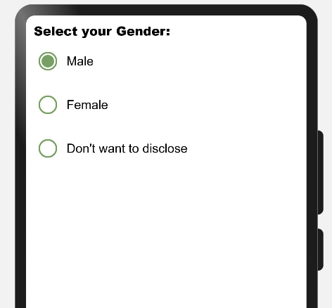
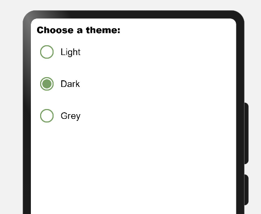

# MaterialUI_libraries

# Overview
Material Design is a design standard for creating and designing websites and apps. Material design was introduced to bring order and unity to web design.

Material design concept was inspired by paper and ink in the physical world. As paper exists in three dimensions having shadows and can be structured in different ways same way material design works. It removed the flat UI's with three dimensional designs.

# What is MaterialUI?
# Benefits
# Typical Use Cases
# Usage Instructions
# List of Libraries

# 1. Buttons
# 2. Radio Buttons

A **radio button** is a component used to select only one option from a predefined set of options, therefore it is also called as ***option button***.

Radio buttons are used where users need to select only one option out of 2 or more options. These options contain circular white space. If any option is selected then circular white space is getting filled with a dot.
If any option is already selected and you will click on any other option then the first option will be deselected.

In the image below **One** is *selected*, **Two** & **Three** are *deselected*.


## 2. Benefits

* Offers an element of flexibility.
* Material Design provides a clean and intuitive interface.
* Can be applied to complex and rare use cases.
* Having a vast set of guidelines and documentation.

## 3. Typical UseCases:

MaterialRadio library can be implemented in most of the commonly used applications where users have to select only one option out of many. Below are some of the examples:



## 4. List of Features:

There are few features of Radio buttons listed below:

***1. Enabled:*** Radio button can be selected. (Vastly used in application)
```
RadioButton({
    model: this.radioModel1,
    onCheckChange: this.onRadioCheck
})
```

***2. Disabled:*** Radio button can't be selected.
```
aboutToAppear() {
    this.radioModel2.setDisabled(true);
}
RadioButton({
    model: this.radioModel2,
    onCheckChange: this.onRadioCheck
})
```

***3. Checked and Enabled:*** Radio button will be selected by default. While clicking the dot will show some ripple effect.
```
RadioButton({
    model: this.radioModel3,
    checked: true,
    onCheckChange: this.onRadioCheck
})
```

***4. Checked and Disabled:*** Radio button will be selected and can't be deselected. This button appears a little bit off color.
```
aboutToAppear() {
    this.radioModel4.setDisabled(true);
}
RadioButton({
    model: this.radioModel4,
    checked: true,
    onCheckChange: this.onRadioCheck
})
```

Please refer below Image: 


## 5. Download & Install:

Install using npm: 
```
npm i ohos-material-radio
```

Details about OpenHarmony NPM environment configuration, click [here](https://gitee.com/openharmony-tpc/docs/blob/master/OpenHarmony_npm_usage.md). 

<hr/>

## 6. Usage Instructions:

1. Import files and code dependencies

```ets
import { RadioButton, RadioGroup, RadioOption, RadioModel }  from '@ohos/material-radio'
```

2. Initialize model data

```
private radioModel: RadioModel = new RadioModel(1, "Radio Label")
```

3. Code for creating radio button

```
RadioButton({
    checked: true,
    model: this.radioModel,
    onCheckChange: (selectedRadioId) => {
        console.log("Selected Radio Button Id:: " + selectedRadioId);
    }
})
```


4. Code for creating radio group

```
RadioGroup(
    {
        selectedRadioId: 1,
        options: [new RadioOption(1, "Option 1"), new RadioOption(2, "Option 2")],
        onCheckChange: (selectedRadioId) => {
            console.log("Selected Radio Button Id:: " + selectedRadioId);
        }
    }
)
```


## 7. Library Features:

### Feature-1: 

***Description:*** User needs to provide radioId, radiolabel, selectedRadioId to create material radio button. Apart from those, users can also send checked and disabled properties also.

***Code Snippet:***

```
private radioModel: RadioModel = new RadioModel(1, “Radio Button”)
radioModel.setRingColor(Color.Blue);
radioModel.setDisabled(false);

RadioButton({
        model: this.radioModel,
        checked: false,
        onCheckChange: (id: number) => {
            console.log(“Radio button selected:: ” + id);
})
```
***Explanation:***

In above code one radio button was created, where button color was set to blue and was enabled for selection. By default it was deselected. While clicking button one toast will appear giving message "Radio button selected::*buttonid*"


Below are list of properties available:

|Properties|Description|
 |:-:|:-:|
 | `setRingColor`|Changing color of radio button circle|
 | `setDisabled` |making radio button enabled or disabled|
 | `checked`|showing radio button is selected or deselected by default|
 |||

***Screenshot:***


<br>

### Feature-2: 

***Description:*** User needs to provide a radio options list to create a material radio group.

***Code Snippet:***

```
private radioOptions: RadioOption [] = [
    new RadioOption(1, “Option 1”),
    new RadioOption(2, “Option 2”),
    new RadioOption(3, “Option 3”)
]

RadioGroup({
        options: this.radioOptions,
        onCheckChange: (id: number) => {
            console.log(“Selected radio button id:: ” + id);
      })
```

***Explanation:***

In the above code one Radio Group was created with 3 sets of options. By default all buttons will be deselected. If you click any option one toast will appear giving the message "Radio button selected::*buttonid*". Again if you click any other option then previous selected option will be deselected and one toast will appear "Radio button selected::*buttonid*"

***Screenshot:***


# 3. Switches
# 4. Checkboxs
# 5. TextFields
# 6. Select Menus
# 7. Lists
# 8. Dialogs
# 9. Progress Indicators
# 10. Tabs
# 11. Snackbar
# 12. Sliders
# 13. Cards
# 14. Fab
# 15. Chips
# 16. Date Picker
# 17. Time Picker
# 18. Bottom Bar
# 19. Banners
# 20. Navigation Drawer
# 21. Navigation Bar
# 22. backdrop
# 23. ImageList
# 24. Bottom Sheets
# 25. Select
# 26. Business Hour Picker
# 27. CalendarView
# 28. Top Bar
# 29. Side Sheet

# Conclusion

# Open source License

This project is based on <a href="https://github.com/whatsupcoders/MaterialUI_libraries/blob/main/LICENSE"> Apache License 2.0 </a> ，please enjoy and participate in open source freely.
